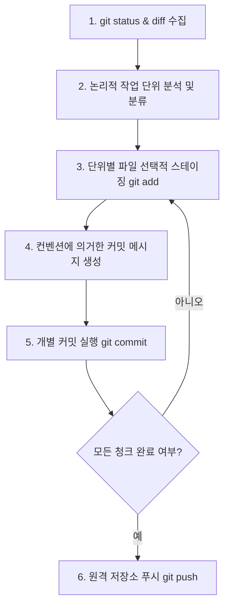

# Git Incremental Commit & Push Skill

이 스킬은 프로젝트 내 Git 변경사항을 단일 커밋으로 뭉뚱그려 올리지 않고, 기능별/파일별로 논리적으로 세분화(Incremental Chunking)하여 커밋 히스토리를 깔끔하게 관리하고 원격 저장소에 자동으로 반영하기 위한 AI 에이전트 전용 가이드라인입니다.

---

## 1. 동작 시나리오 및 흐름 (Workflow)



---

## 2. 세부 행동 지침 (Detailed Instructions)

### 2.1. 변경사항 분석 및 세분화 (Incremental Chunking)
*   에이전트는 작업이 완료된 후 단순히 `git commit -a`나 `git add .`를 수행하여 모든 변경사항을 한 번에 커밋해서는 안 됩니다.
*   `git diff` 및 `git status`를 실행하여 어떤 파일이 추가, 수정, 삭제되었는지 분석합니다.
*   서로 독립된 기능 구현이나 버그 수정, 문서 보강 작업이 혼재되어 있다면, 이를 **논리적으로 가장 작은 변경 단위(Minimal Logical Unit)**로 분류하여 단계별 커밋으로 계획을 수립합니다.

### 2.2. 커밋 메시지 컨벤션 규격 (Commit Convention)
모든 커밋 메시지는 반드시 아래의 형식을 철저히 엄수합니다.

```text
(영어 카테고리): (한글로 작성된 명확하고 구체적인 작업 메시지)
```

#### 허용되는 영어 카테고리 목록
| 카테고리 | 설명 | 예시 |
| :--- | :--- | :--- |
| `feat` | 새로운 기능의 추가 및 구현 | `feat: 사용자 로그인 화면 레이아웃 구성` |
| `fix` | 버그 해결 및 오류 수정 | `fix: API 중복 호출 오류 현상 수정` |
| `docs` | 문서의 추가, 수정, 보강 (README, 설계문서 등) | `docs: AGENTS.md 에이전트 가이드라인 보강` |
| `style` | 코드의 기능적 변화가 없는 서식, 세미콜론, 포맷팅 수정 | `style: 변수명 표기법 카멜케이스로 정비` |
| `refactor` | 코드의 구조 개선 및 성능 최적화 (기능 변화 없음) | `refactor: 중복 렌더링을 방지하기 위한 함수 구조화` |
| `test` | 테스트 코드의 추가 및 수정 | `test: 회원가입 로직 유닛 테스트 추가` |
| `chore` | 패키지 설정 수정, 빌드 스크립트 변경 등의 기타 작업 | `chore: package.json 패키지 의존성 버전 업그레이드` |

---

## 3. 에이전트 실행 단계별 가이드 (Execution Checklist)

### [단계 1] 변경 상태 및 브랜치 파악
*   `git status`와 `git branch`를 실행하여 현재 작업 중인 브랜치와 워킹 디렉토리 상태를 파악합니다.

### [단계 2] 스테이징 및 개별 커밋 실행
*   세분화 계획에 맞춰 각 논리 단위에 포함된 파일들만 선택적으로 스테이징합니다.
    *   명령어 예시: `git add <특정 파일 경로>`
*   컨벤션에 맞춘 메시지로 커밋을 생성합니다.
    *   명령어 예시: `git commit -m "feat: 로그인 API 모듈 구현"`
*   이 작업을 변경사항이 모두 소진될 때까지 루프 형태로 반복 수행합니다.

### [단계 3] 푸시(Push) 수행
*   모든 로컬 커밋이 정상 완료되면, 현재 활성화된 브랜치를 원격 저장소(origin)로 푸시합니다.
    *   명령어 예시: `git push origin <현재 브랜치명>`

---

## 4. 예외 상황 처리 (Edge Cases)

1.  **충돌(Conflict) 발생 시**: 푸시 전 원격의 최신 커밋과의 충돌이 감지되면 자동으로 `git pull`을 시도하거나 사용자에게 충돌 확인을 정중하게 요청합니다.
2.  **커밋 메시지 글자 수**: 메시지 내용은 한글 15자 내외로 간결하고 직관적으로 서술하도록 제한합니다.
